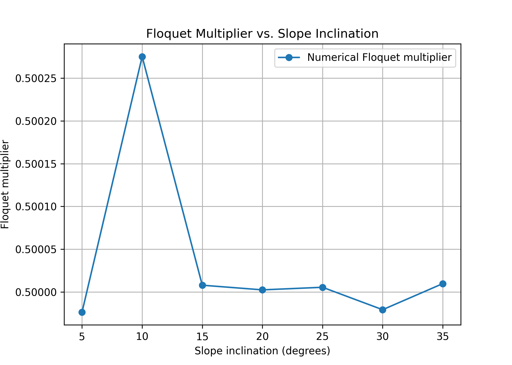
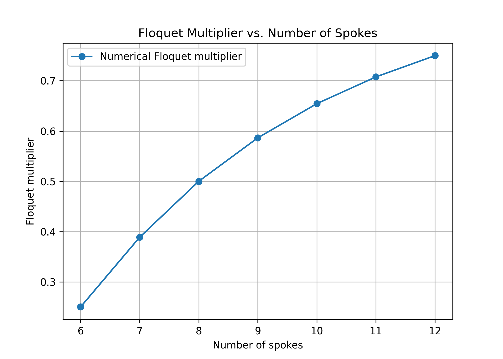

# Abha Bhole
# MAE 4110

---

# Assignment 1 Deliverable

A markdown file reporting:

1. An explanation of your sanity checks, including what you expected and what happened; (5 pts)
2. A state-space plot showing the RoA of every stable attractor, including fixed points and limit cycles; (5 pts)
3. Your one-dimensional return-map plot, with its fixed point and the identity line clearly marked; (5 pts)
4. Visualization and discussion of how the slope and number of spokes affects the RoA and local convergence (10 pts)

---

## 1. Sanity Checks

### Model Notes

For the current model, I use the following angle convention:

- $\theta$ is measured from the global upward vertical.
- Positive $\theta$ is clockwise, while negative $\theta$ is counterclockwise.
- The downhill direction of the slope is clockwise, so positive $\theta$ is also the downhill direction.
- The slope angle is denoted by $\gamma$.
- The angle between adjacent spokes is $2\alpha$, where

$$
\alpha = \frac{\pi}{N}.
$$

With this convention, the continuous dynamics while a single spoke is in contact with the ground are

$$
\dot{\theta} = \dot{\theta},
$$

$$
\ddot{\theta} = \frac{g}{l}\sin\theta.
$$

Therefore, the continuous-time state-space dynamics are

$$
\begin{aligned}
\dot{\theta} &= \dot{\theta},\\
\ddot{\theta} &= \frac{g}{l}\sin\theta.
\end{aligned}
$$

Because $\theta$ is measured from the global vertical, the gravitational torque depends directly on $\theta$. The slope angle $\gamma$ determines the orientation of the ground and therefore appears in the impact condition.

### Impact and Reset

An impact occurs when the next spoke reaches the slope. With the current angle convention, the pre-impact stance-spoke angle is

$$
\theta^- = \gamma + \alpha.
$$

At this instant, the adjacent spoke becomes the new stance spoke. Since adjacent spokes are separated by $2\alpha$, the angular coordinate is shifted by $2\alpha$:

$$
\theta^+ = \theta^- - 2\alpha.
$$

Substituting the impact angle gives

$$
\theta^+ = (\gamma+\alpha)-2\alpha
= \gamma-\alpha.
$$

Thus, after the impact, the new stance spoke begins at

$$
\theta^+ = \gamma-\alpha.
$$

The angular velocity is reset using conservation of angular momentum about the new contact point:

$$
\dot{\theta}^+ = \dot{\theta}^-\cos(2\alpha).
$$

Therefore, the complete impact/reset map used in the simulation is

$$
\theta^+ = \theta^- - 2\alpha,
\qquad
\dot{\theta}^+ = \dot{\theta}^-\cos(2\alpha).
$$

These continuous dynamics and discrete impact/reset dynamics together define the hybrid rimless-wheel model used in the simulation.

## 1.1 Angle vs. Time

I first plotted the stance-spoke angle $\theta$ versus time to check the overall behavior of the simulation. For a rolling rimless wheel, I expected $\theta$ to evolve continuously during each stance phase and then reset when the next spoke contacts the slope.

The simulation showed the expected repeated stance phases and discrete angle resets at impact. The resulting trajectory had the expected periodic behavior associated with the rolling gait.

## 1.2 Phase Portrait

! also plotted the trajectory in state space using $\theta$ and $\dot{\theta}$. The initial condition for this test was $(\theta,\dot{\theta})=(10^\circ,0)$.

The phase portrait shows the continuous evolution during each stance phase and the changes in state caused by impacts. The trajectory approaches a repeating pattern, providing a qualitative check that the simulation converges toward a periodic rolling gait.

---

# 2. Region of Attraction

For the RoA calculation, I evaluated a $100\times100$ grid of initial conditions in $(\theta,\dot{\theta})$ space. Each initial condition was simulated and classified according to its long-term behavior.

For the parameters shown below, the simulation found no stable fixed-point attractor. The stable attractor observed was the periodic rolling gait.

Slope angle: $10^\circ$

Number of spokes: $8$

Stable fixed-point points: 0

Stable periodic rolling-gait points: 5372

Unclassified points: 4628

The colored region shows the initial conditions that converge to the stable periodic rolling gait. Initial conditions outside this region were not classified as converging to an attractor within the simulation.

---

# 3. Return Map and Floquet Multiplier

The one-dimensional return map was constructed using the post-impact angular velocity as the Poincaré section variable. The fixed point of the return map corresponds to the periodic rolling gait.

For the parameters

$$
\gamma = 20^\circ,
\qquad
N=8,
$$

the theoretical fixed-point velocities are

$$
\dot{\theta}^-_* = 3.20498\ \mathrm{rad/s},
$$

and

$$
\dot{\theta}^+_* = 2.26626\ \mathrm{rad/s}.
$$

The numerical return-map fixed point agreed with the theoretical value to within approximately $10^{-7}\ \mathrm{rad/s}$.

The return map intersects the identity line at the periodic gait fixed point. The local Floquet multiplier was calculated using a finite difference about this fixed point:

$$
\lambda =
\frac{P(v^+_*+\epsilon)-P(v^+_*-\epsilon)}
{2\epsilon},
$$

with $\epsilon=0.01$.

The resulting multiplier was

$$
\lambda = 0.5000025.
$$

Since

$$
|\lambda| < 1,
$$

the periodic rolling gait is locally stable. The value of approximately $0.5$ also indicates that small perturbations decay from one step to the next.

---

# 4. Floquet Multiplier and RoA Sweeps

## Floquet Multiplier: Slope Sweep

The slope angle was varied from 5 to 35 degrees while keeping the number of spokes fixed at 8. The fixed-point velocities and Floquet multipliers are shown below.

| Slope Angle (degrees) | Pre-impact Fixed Point (rad/s) | Post-impact Fixed Point (rad/s) | Floquet Multiplier |
|---:|---:|---:|---:|
| 5  | 1.6179 | 1.1440 | 0.499977 |
| 10 | 2.2837 | 1.6148 | 0.500275 |
| 15 | 2.7880 | 1.9714 | 0.500008 |
| 20 | 3.2050 | 2.2663 | 0.500003 |
| 25 | 3.5627 | 2.5192 | 0.500006 |
| 30 | 3.8751 | 2.7401 | 0.499979 |
| 35 | 4.1504 | 2.9348 | 0.500010 |

The Floquet multiplier remains approximately 0.50 for all tested slope angles. Therefore, the slope has little effect on the local convergence rate of the stable periodic gait.

## Region of Attraction: Slope Sweep

The RoA was also computed for each slope angle using a 100 × 100 state-space grid. The results are summarized below.

| Slope Angle (degrees) | Stable Fixed Point | Stable Limit Cycle | Unclassified |
|---:|---:|---:|---:|
| 5  | 0 (0.00%) | 4686 (46.86%) | 5314 (53.14%) |
| 10 | 0 (0.00%) | 5372 (53.72%) | 4628 (46.28%) |
| 15 | 0 (0.00%) | 5771 (57.71%) | 4229 (42.29%) |
| 20 | 0 (0.00%) | 6067 (60.67%) | 3933 (39.33%) |
| 25 | 0 (0.00%) | 6335 (63.35%) | 3665 (36.65%) |
| 30 | 0 (0.00%) | 6595 (65.95%) | 3405 (34.05%) |
| 35 | 0 (0.00%) | 6853 (68.53%) | 3147 (31.47%) |

The RoA of the stable limit cycle increases as the slope angle increases. Overall, it seems like the slope has a strong effect on the size of the RoA but very little effect on local convergence, since the Floquet multiplier remains close to 0.50.

## Floquet Multiplier: Number of Spokes Sweep

The number of spokes was varied from 6 to 12 while keeping the slope angle fixed at 20 degrees.

| Number of Spokes | Pre-impact Fixed Point (rad/s) | Post-impact Fixed Point (rad/s) | Floquet Multiplier |
|---:|---:|---:|---:|
| 6  | 2.9912 | 1.4956 | 0.250071 |
| 7  | 3.0865 | 1.9244 | 0.388732 |
| 8  | 3.2050 | 2.2663 | 0.500003 |
| 9  | 3.3331 | 2.5533 | 0.586492 |
| 10 | 3.4647 | 2.8030 | 0.654468 |
| 11 | 3.5967 | 3.0257 | 0.707709 |
| 12 | 3.7275 | 3.2281 | 0.749979 |

Unlike the slope sweep, increasing the number of spokes has a clear effect on the Floquet multiplier. The multiplier increases from approximately 0.25 for 6 spokes to approximately 0.75 for 12 spokes. Since all of these values are less than 1 in magnitude, the periodic gait remains locally stable. However, a larger Floquet multiplier means that perturbations decay more slowly, so the local convergence becomes slower as the number of spokes increases.

## Region of Attraction: Number of Spokes Sweep

The RoA was computed for 6 through 12 spokes at a fixed slope angle of 20 degrees.

| Number of Spokes | Stable Fixed Point | Stable Limit Cycle | Unclassified |
|---:|---:|---:|---:|
| 6  | 0 (0.00%) | 5948 (59.48%) | 4052 (40.52%) |
| 7  | 0 (0.00%) | 6051 (60.51%) | 3949 (39.49%) |
| 8  | 0 (0.00%) | 6067 (60.67%) | 3933 (39.33%) |
| 9  | 0 (0.00%) | 6072 (60.72%) | 3928 (39.28%) |
| 10 | 0 (0.00%) | 6072 (60.72%) | 3928 (39.28%) |
| 11 | 0 (0.00%) | 6072 (60.72%) | 3928 (39.28%) |
| 12 | 0 (0.00%) | 6073 (60.73%) | 3927 (39.27%) |

The RoA changes only slightly as the number of spokes increases. The stable limit-cycle region ranges from 59.48% for 6 spokes to 60.73% for 12 spokes. Therefore, over the range tested, the number of spokes has relatively little effect on the overall RoA.

However, the number of spokes has a much stronger effect on local convergence. As the number of spokes increases, the Floquet multiplier moves closer to 1, indicating slower convergence to the periodic gait. Thus, increasing the number of spokes produces a small change in the RoA but a significant decrease in the local convergence rate.

Overall, the sweeps show that slope angle and number of spokes affect the rimless wheel in different ways. Increasing the slope increases the RoA while leaving the local convergence rate nearly unchanged. Increasing the number of spokes has little effect on the RoA but causes slower local convergence, as indicated by the increasing Floquet multiplier.