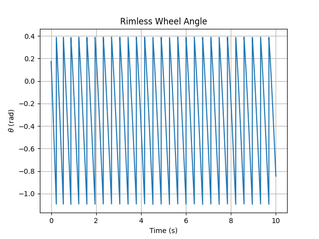
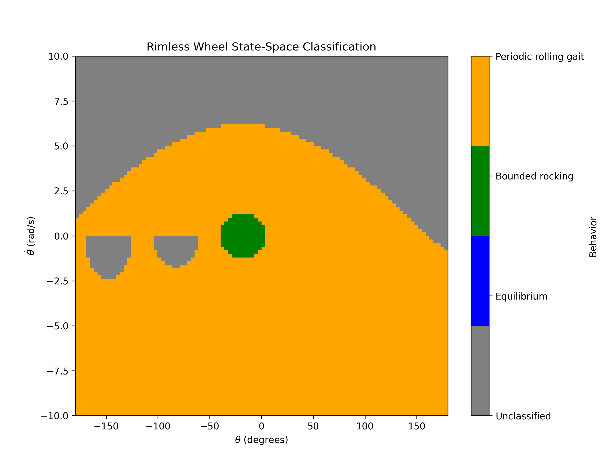
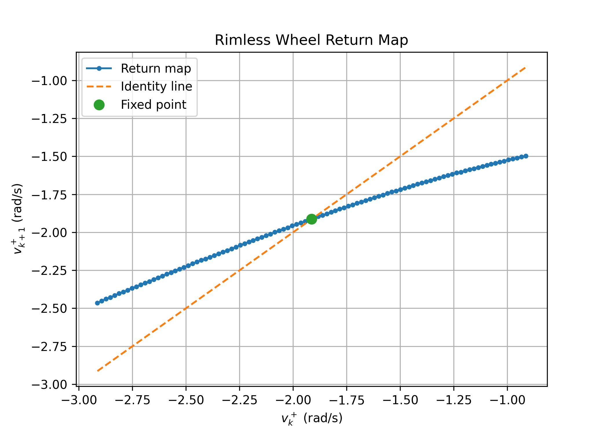
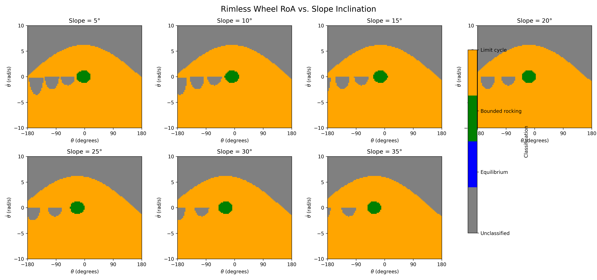
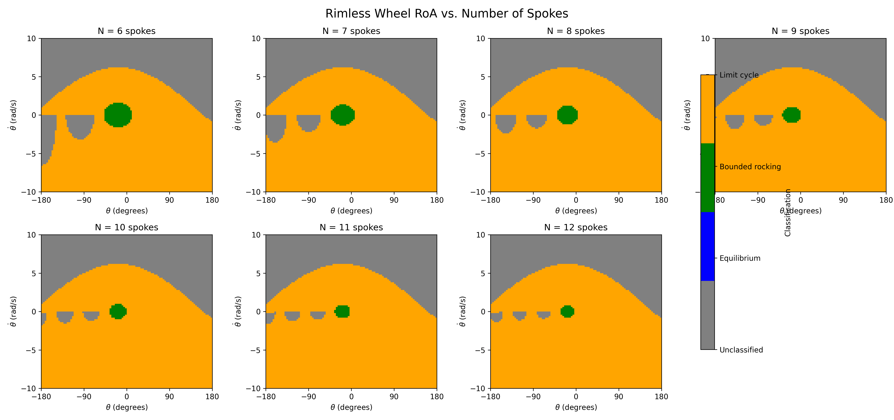

Abha Bhole
MAE 4110

**-------------------------------------------------------------------------**

## Assignment 1 Deliverable

A markdown file reporting:

1. an explanation of your sanity checks, including what you expected and what happened; (5 pts)
2. a state-space plot showing the RoA of every stable attractor, including fixed points and limit cycles; (5 pts)
3. your one-dimensional return-map plot, with its fixed point and the identity line clearly marked; and (5 pts)
4. visualization and discussion of how the slope and number of spokes affects the RoA and local convergence (10 pts)

**-------------------------------------------------------------------------**

**-------------------------------------------------------------------------**

## 1. Sanity Checks

### Model Notes

For the current model, I use the following angle convention:

- $\theta$ is measured from the **global upward vertical**.
- Positive $\theta$ is counterclockwise, while negative $\theta$ is clockwise.
- The downhill direction of the slope is clockwise.
- The slope angle is denoted by $\gamma$.
- The angle between adjacent spokes is $2\alpha$, where

$$
\alpha = \frac{\pi}{N}.
$$

With this convention, the continuous dynamics while a single spoke is in contact with the ground are

$$\ddot{\theta}=-\frac{g}{l}\sin(\theta+\gamma).$$

Therefore, the continuous-time state-space dynamics are

$$
\dot{\theta} = \dot{\theta},
\qquad
\ddot{\theta}
=
-\frac{g}{l}\sin(\theta+\gamma).
$$

The $\gamma$ term appears because $\theta$ is measured relative to the **global vertical**, rather than relative to the slope normal.

#### Impact and Reset

An impact occurs when the next spoke reaches the slope. The pre-impact stance-spoke angle is

$$
\theta^- = -\gamma-\alpha.
$$

At this instant, the adjacent spoke becomes the new stance spoke. The new stance spoke is at $+\alpha$ relative to the global vertical, so the angular coordinate is shifted by

$$
\gamma+2\alpha.
$$

So the angle reset is

$$
\theta^+
=
\theta^-+\gamma+2\alpha.
$$

The new spoke then begins its trajectory at

$$
\theta^+ = \alpha.
$$

The angular velocity is reset using conservation of angular momentum about the new contact point:

$$
\dot{\theta}^+
=
\dot{\theta}^-\cos(2\alpha).
$$

Therefore, the complete impact/reset map used in the simulation is

$$
\boxed{
\theta^+ = \theta^-+\gamma+2\alpha,
\qquad
\dot{\theta}^+ =
\dot{\theta}^-\cos(2\alpha)
}
$$

These continuous dynamics and discrete impact/reset dynamics together define the hybrid rimless-wheel model used in the simulation.

### 1.1 Angle vs. Time

I first plotted the stance-spoke angle $\theta$ versus time to get a general sense of the wheel's motion and verify that the simulation behaved as expected. For a stationary wheel, I would expect $\theta$ to remain approximately constant. In contrast, a rolling rimless wheel should produce a periodic sawtooth-like trajectory: during each stance phase, $\theta$ evolves continuously until the next spoke reaches the slope, at which point the stance spoke switches and the angle is reset.

The figure below shows (example)

### 1.2 Phase Portrait

I also plotted the trajectory in state space, using $\theta$ and $\dot{\theta}$ as the state variables. The initial condition for this test was $(\theta,\dot{\theta})=(10^\circ,0)$.

The phase portrait provides an additional qualitative check of the simulated dynamics by showing how angular position and angular velocity evolve together during the continuous stance phase and across discrete impacts. The repeated trajectory associated with successive impacts also provides a visual indication of the wheel approaching its periodic rolling gait.

**-------------------------------------------------------------------------**

## 2. Region of Attraction

I estimated the region of attraction (RoA) by simulating a grid of initial conditions and classifying each trajectory according to its long-term behavior. A trajectory was classified as converging to the walking limit cycle if its final five impact velocities differed by less than $0.05$ rad/s. I also distinguished trajectories exhibiting bounded rocking behavior from those that remained unclassified.

For the $20^\circ$ slope and $N=8$ spokes, I used a $100\times100$ grid of initial conditions with

$$
\theta\in[-\pi,\pi)
$$

and

$$
\dot{\theta}\in[-10,10]\text{ rad/s}.
$$

The simulation produced:

- Equilibrium: 0 points
- Bounded rocking: 120 points
- Limit cycle: 6,624 points
- Unclassified: 3,256 points

The resulting classification shows a large region of initial conditions that converge to the periodic walking gait, along with a smaller region exhibiting bounded rocking behavior. The unclassified region consists of trajectories that did not satisfy either classification criterion within the simulation time and therefore cannot automatically be interpreted as unstable or divergent.

The equilibrium of the continuous dynamics occurs at

$$
(\theta,\dot{\theta})=(-\gamma,0).
$$

For the $20^\circ$ slope used here,

$$
(\theta,\dot{\theta})=(-20^\circ,0).
$$

This equilibrium is not asymptotically stable. Instead, it lies within the portion of the state space that leads to bounded rocking behavior.

The equilibrium itself does not appear as one of the classified equilibrium points in the $100\times100$ grid because the finite grid does not necessarily contain the exact state $(\theta=-\gamma,\dot{\theta}=0)$. The resolution of the grid was not made finer than 100x100 due to computing constraints.

**-------------------------------------------------------------------------**

## 3. Return Map and Floquet Multiplier

For $N=8$ spokes and a slope angle of $20^\circ$, I constructed a one-dimensional return map using the angular velocity immediately after each impact as the Poincaré-section variable. The trajectory was simulated until the post-impact velocity converged to a fixed point.

The simulation began from

$$
(\theta,\dot{\theta})=(20^\circ,0).
$$

The return map converged to the theoretical post-impact fixed point

$$
\dot{\theta}^{+\ast}=-1.913409\text{ rad/s}.
$$

Using a perturbation of

$$
\epsilon=0.01,
$$

the return-map values were

$$
P(x^\ast-\epsilon)=-1.918250,
$$

and

$$
P(x^\ast+\epsilon)=-1.908324.
$$

The Floquet multiplier was

$$
\lambda =
\frac{P(x^\ast+\epsilon)-P(x^\ast-\epsilon)}
{2\epsilon}
=
0.496331.
$$

Because

$$
\lambda=0.496331<1,
$$

the walking limit cycle is locally asymptotically stable. A perturbation from the periodic gait is therefore reduced from one step to the next.

indicating that the simulated motion has reached the expected periodic walking gait.

The pre-impact and post-impact angular velocities are related by the impact map

$$
\dot{\theta}^{+}
=
\dot{\theta}^{-}\cos(2\alpha),
$$

where

$$
\alpha=\frac{\pi}{N}.
$$

For $N=8$,

$$
\alpha=22.5^\circ,
$$

so

$$
\dot{\theta}^{-\ast}
=
\frac{\dot{\theta}^{+\ast}}{\cos(45^\circ)}
\approx-2.7060\text{ rad/s}.
$$

Therefore, the periodic gait has approximately

$$
\boxed{\dot{\theta}^{-\ast}=-2.7060\text{ rad/s}}
$$

immediately before impact and

$$
\boxed{\dot{\theta}^{+\ast}=-1.9134\text{ rad/s}}
$$

immediately after impact.

The negative sign is consistent with the chosen coordinate convention: clockwise rotation corresponds to downhill motion.

**-------------------------------------------------------------------------**

## 4. Floquet Multiplier and RoA Sweeps

### Floquet Multiplier: Slope Sweep

Slope Sweep

I varied the slope angle from $5^\circ$ to $35^\circ$ while keeping the number of spokes fixed at $N=8$. For each slope, I computed the pre-impact fixed point, post-impact fixed point, and Floquet multiplier.

| Slope angle | Pre-impact fixed point (rad/s) | Post-impact fixed point (rad/s) | Floquet multiplier |
| -----------: | -----------------------------: | ------------------------------: | -----------------: |
| $5^\circ$  | -1.2028 | -0.8505 | 0.503190 |
| $10^\circ$ | -1.7772 | -1.2567 | 0.493510 |
| $15^\circ$ | -2.2631 | -1.6003 | 0.508878 |
| $20^\circ$ | -2.7060 | -1.9134 | 0.496331 |
| $25^\circ$ | -3.1214 | -2.2071 | 0.501953 |
| $30^\circ$ | -3.5164 | -2.4865 | 0.508047 |
| $35^\circ$ | -3.8948 | -2.7540 | 0.492653 |

The fixed-point angular velocity increases in magnitude as the slope angle increases. This is consistent with the greater gravitational component driving the wheel downhill on steeper slopes.

In contrast, the Floquet multiplier remains close to $0.5$ throughout the sweep. All values remain well below one, indicating that the walking gait remains locally asymptotically stable across the tested slope range. The relatively small variation in the multiplier also suggests that the local convergence rate is not strongly affected by slope angle over this range.

### Region of Attraction: Slope Sweep

For the slope-angle sweep, I varied the slope angle from $5^\circ$ to $35^\circ$ while keeping the number of spokes fixed at $N=8$. For each slope angle, I evaluated a $100\times100$ grid of initial conditions, giving 10,000 initial conditions per sweep. The initial conditions were classified as equilibrium, bounded rocking, periodic rolling gait, or unclassified.

| Slope angle | Equilibrium | Bounded rocking | Limit cycle | Unclassified |
| -----------: | ----------: | --------------: | -----------: | -------------: |
| $5^\circ$ | 0 (0.00%) | 118 (1.18%) | 6,486 (64.86%) | 3,396 (33.96%) |
| $10^\circ$ | 0 (0.00%) | 118 (1.18%) | 6,532 (65.32%) | 3,350 (33.50%) |
| $15^\circ$ | 0 (0.00%) | 118 (1.18%) | 6,616 (66.16%) | 3,266 (32.66%) |
| $20^\circ$ | 0 (0.00%) | 120 (1.20%) | 6,624 (66.24%) | 3,256 (32.56%) |
| $25^\circ$ | 0 (0.00%) | 122 (1.22%) | 6,615 (66.15%) | 3,263 (32.63%) |
| $30^\circ$ | 0 (0.00%) | 118 (1.18%) | 6,647 (66.47%) | 3,235 (32.35%) |
| $35^\circ$ | 0 (0.00%) | 116 (1.16%) | 6,672 (66.72%) | 3,212 (32.12%) |

The fraction of initial conditions classified as belonging to the periodic rolling gait increases overall as the slope angle increases, from $64.86\%$ at $5^\circ$ to $66.72\%$ at $35^\circ$. The bounded-rocking region remains relatively small, accounting for approximately $1.2\%$ of the sampled state space throughout the sweep.

The unclassified region decreases from $33.96\%$ to $32.12\%$ as the slope angle increases.

### Floquet Multiplier: Number of Spokes Sweep

I next varied the number of spokes from $N=6$ to $N=12$, keeping the slope angle fixed at $20^\circ$.

| Number of spokes | Pre-impact fixed point (rad/s) | Post-impact fixed point (rad/s) | Floquet multiplier |
| ---------------: | -----------------------------: | ------------------------------: | -----------------: |
| 6  | -2.4166 | -1.2083 | 0.258493 |
| 7  | -2.5509 | -1.5905 | 0.391724 |
| 8  | -2.7060 | -1.9134 | 0.496331 |
| 9  | -2.8716 | -2.1997 | 0.592395 |
| 10 | -3.0429 | -2.4617 | 0.654423 |
| 11 | -3.2175 | -2.7067 | 0.710822 |
| 12 | -3.3939 | -2.9392 | 0.752553 |

The number of spokes has a much stronger effect on the Floquet multiplier than the slope angle. As the number of spokes increases, the magnitude of both the pre-impact and post-impact fixed-point velocities increases, while the Floquet multiplier also increases.

For all tested values,

$$
|\lambda|<1,
$$

so the walking gait remains locally asymptotically stable. However, the multiplier increases from approximately $0.258$ for six spokes to $0.753$ for twelve spokes. Since a larger multiplier closer to one corresponds to slower decay of perturbations, the walking gait becomes less strongly locally stable as the number of spokes increases.

### Region of Attraction: Number of Spokes Sweep

I next varied the number of spokes from $N=6$ to $N=12$, keeping the slope angle fixed at $20^\circ$. As in the slope sweep, each case used a $100\times100$ grid, corresponding to 10,000 initial conditions.

| Number of spokes | Equilibrium | Bounded rocking | Limit cycle | Unclassified |
| ---------------: | ----------: | --------------: | -----------: | -------------: |
| 6  | 0 (0.00%) | 210 (2.10%) | 6,290 (62.90%) | 3,500 (35.00%) |
| 7  | 0 (0.00%) | 152 (1.52%) | 6,485 (64.85%) | 3,363 (33.63%) |
| 8  | 0 (0.00%) | 120 (1.20%) | 6,624 (66.24%) | 3,256 (32.56%) |
| 9  | 0 (0.00%) | 90 (0.90%) | 6,711 (67.11%) | 3,199 (31.99%) |
| 10 | 0 (0.00%) | 78 (0.78%) | 6,740 (67.40%) | 3,182 (31.82%) |
| 11 | 0 (0.00%) | 62 (0.62%) | 6,767 (67.67%) | 3,171 (31.71%) |
| 12 | 0 (0.00%) | 52 (0.52%) | 6,789 (67.89%) | 3,159 (31.59%) |

Increasing the number of spokes produces a clearer change in the global classification than the slope-angle sweep. The fraction of initial conditions classified as belonging to the periodic rolling gait increases from $62.90\%$ for $N=6$ to $67.89\%$ for $N=12$. At the same time, the bounded-rocking region decreases from $2.10\%$ to $0.52\%$, while the unclassified fraction decreases from $35.00\%$ to $31.59\%.

