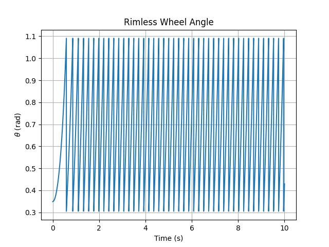
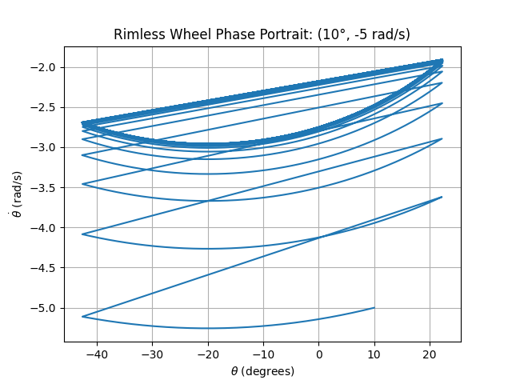
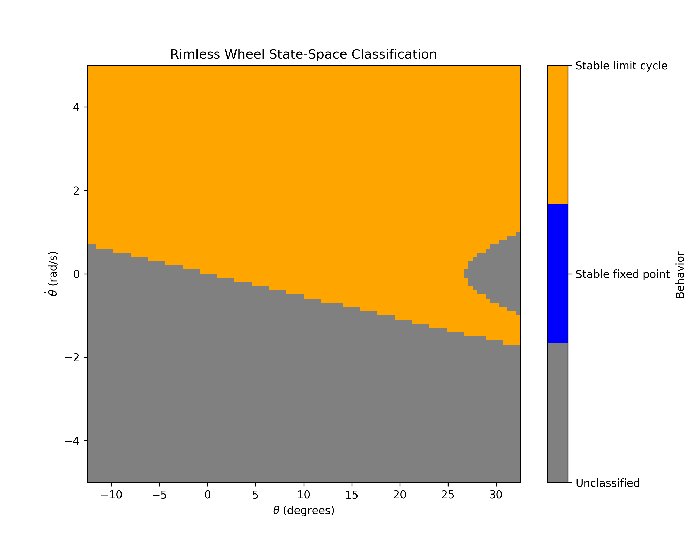
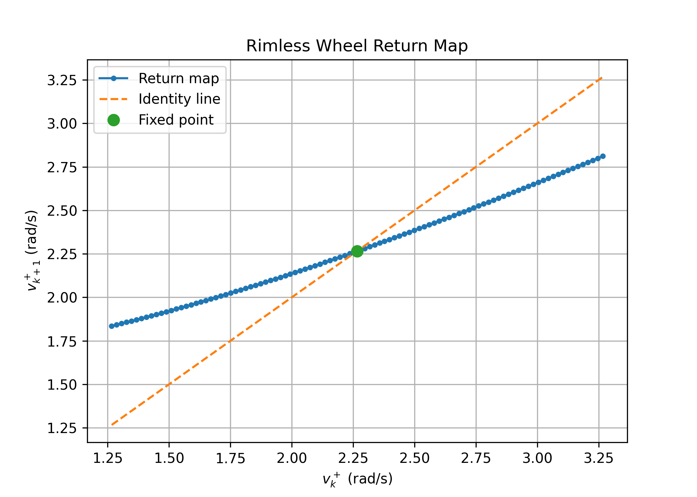
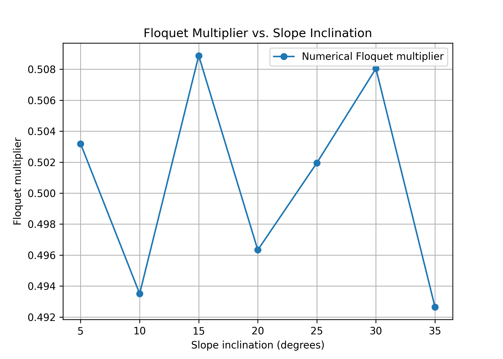
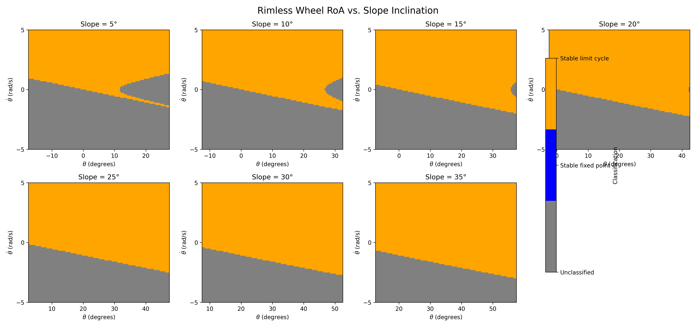
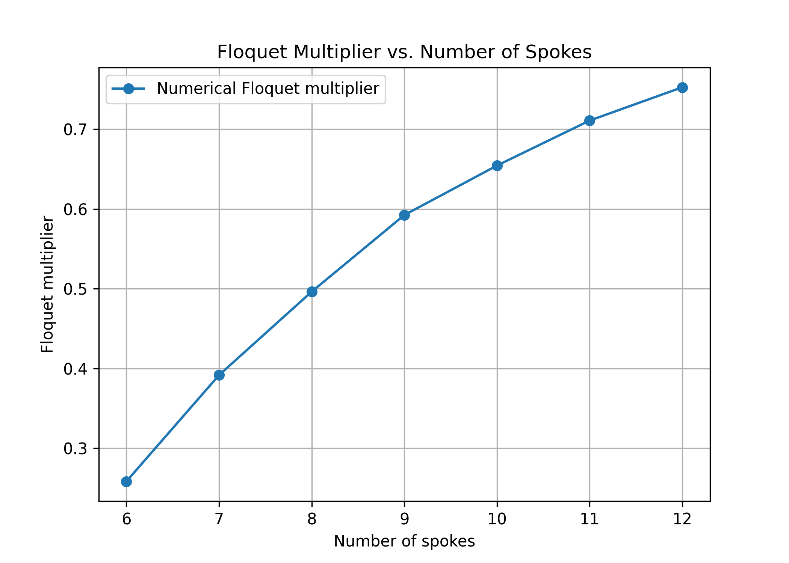
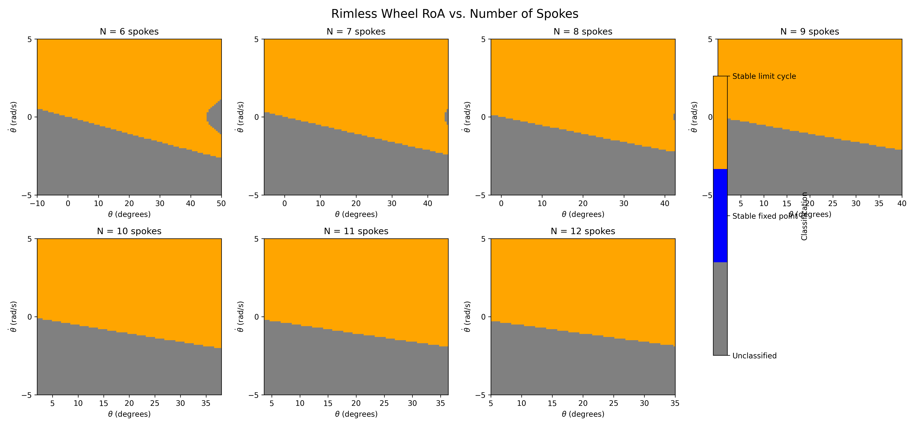

# Abha Bhole
# MAE 4110

---

# Assignment 1 Deliverable

A markdown file reporting:

1. An explanation of your sanity checks, including what you expected and what happened; (5 pts)
2. A state-space plot showing the RoA of every stable attractor, including fixed points and limit cycles; (5 pts)
3. Your one-dimensional return-map plot, with its fixed point and the identity line clearly marked; (5 pts)
4. Visualization and discussion of how the slope and number of spokes affects the RoA and local convergence (10 pts)

---

# Assignment 1 Deliverable

## 1. Sanity Checks

### Model Notes

For the current model, I use the following angle convention:

- $\theta$ is measured from the global upward vertical.
- Positive $\theta$ is clockwise, while negative $\theta$ is counterclockwise.
- The downhill direction of the slope is clockwise, so positive $\theta$ is also the downhill direction.
- The slope angle is denoted by $\gamma$.
- The angle between adjacent spokes is $2\alpha$, where

$$
\alpha = \frac{\pi}{N}.
$$

With this convention, the continuous dynamics while a single spoke is in contact with the ground are

$$
\dot{\theta} = \dot{\theta},
$$

$$
\ddot{\theta} = \frac{g}{l}\sin\theta.
$$

Therefore, the continuous-time state-space dynamics are

$$
\begin{aligned}
\dot{\theta} &= \dot{\theta},\\
\ddot{\theta} &= \frac{g}{l}\sin\theta.
\end{aligned}
$$

Because $\theta$ is measured from the global vertical, the gravitational torque depends directly on $\theta$. The slope angle $\gamma$ determines the orientation of the ground and therefore appears in the impact condition.

### Impact and Reset

An impact occurs when the next spoke reaches the slope. With the current angle convention, the pre-impact stance-spoke angle is

$$
\theta^- = \gamma + \alpha.
$$

At this instant, the adjacent spoke becomes the new stance spoke. Since adjacent spokes are separated by $2\alpha$, the angular coordinate is shifted by $2\alpha$:

$$
\theta^+ = \theta^- - 2\alpha.
$$

Substituting the impact angle gives

$$
\theta^+ = (\gamma+\alpha)-2\alpha
= \gamma-\alpha.
$$

Thus, after the impact, the new stance spoke begins at

$$
\theta^+ = \gamma-\alpha.
$$

The angular velocity is reset using conservation of angular momentum about the new contact point:

$$
\dot{\theta}^+ = \dot{\theta}^-\cos(2\alpha).
$$

Therefore, the complete impact/reset map used in the simulation is

$$
\theta^+ = \theta^- - 2\alpha,
\qquad
\dot{\theta}^+ = \dot{\theta}^-\cos(2\alpha).
$$

These continuous dynamics and discrete impact/reset dynamics together define the hybrid rimless-wheel model used in the simulation.

## 1.1 Angle vs. Time

I first plotted the stance-spoke angle $\theta$ versus time to check the overall behavior of the simulation. For a rolling rimless wheel, I expected $\theta$ to evolve continuously during each stance phase and then reset when the next spoke contacts the slope.

The simulation showed the expected repeated stance phases and discrete angle resets at impact. The resulting trajectory had the expected periodic behavior associated with the rolling gait.

## 1.2 Phase Portrait

! also plotted the trajectory in state space using $\theta$ and $\dot{\theta}$. The initial condition for this test was $(\theta,\dot{\theta})=(10^\circ,0)$.

The phase portrait shows the continuous evolution during each stance phase and the changes in state caused by impacts. The trajectory approaches a repeating pattern, providing a qualitative check that the simulation converges toward a periodic rolling gait.

---

# 2. Region of Attraction

For the RoA calculation, I evaluated a $100\times100$ grid of initial conditions in $(\theta,\dot{\theta})$ space. Each initial condition was simulated and classified according to its long-term behavior.

For the parameters shown below, the simulation found no stable fixed-point attractor. The stable attractor observed was the periodic rolling gait.

Slope angle: $10^\circ$

Number of spokes: $8$

Stable fixed-point points: 0

Stable periodic rolling-gait points: 5372

Unclassified points: 4628

The colored region shows the initial conditions that converge to the stable periodic rolling gait. Initial conditions outside this region were not classified as converging to an attractor within the simulation.

---

# 3. Return Map and Floquet Multiplier
# 3. Return Map and Floquet Multiplier

The one-dimensional return map was constructed using the post-impact angular velocity as the Poincaré section variable. The fixed point of the return map corresponds to the periodic rolling gait.

For the parameters

$$
\gamma = 20^\circ,
\qquad
N=8,
$$

the theoretical fixed-point velocities are

$$
\dot{\theta}^-_* = 3.20498\ \mathrm{rad/s},
$$

and

$$
\dot{\theta}^+_* = 2.26626\ \mathrm{rad/s}.
$$

The numerical return-map fixed point agreed with the theoretical value to within approximately $10^{-7}\ \mathrm{rad/s}$.

The return map intersects the identity line at the periodic gait fixed point. The local Floquet multiplier was calculated using a finite difference about this fixed point:

$$
\lambda =
\frac{P(v^+_*+\epsilon)-P(v^+_*-\epsilon)}
{2\epsilon},
$$

with $\epsilon=0.01$.

The resulting multiplier was

$$
\lambda = 0.5000025.
$$

Since

$$
|\lambda| < 1,
$$

the periodic rolling gait is locally stable. The value of approximately $0.5$ also indicates that small perturbations decay from one step to the next.

---

# 4. Floquet Multiplier and RoA Sweeps

## Floquet Multiplier: Slope Sweep

Sweeping slope = 5 degrees
  Pre-impact fixed point:  1.6179 rad/s
  Post-impact fixed point: 1.1440 rad/s
  Floquet multiplier:      0.499977
Sweeping slope = 10 degrees
  Pre-impact fixed point:  2.2837 rad/s
  Post-impact fixed point: 1.6148 rad/s
  Floquet multiplier:      0.500275
Sweeping slope = 15 degrees
  Pre-impact fixed point:  2.7880 rad/s
  Post-impact fixed point: 1.9714 rad/s
  Floquet multiplier:      0.500008
Sweeping slope = 20 degrees
  Pre-impact fixed point:  3.2050 rad/s
  Post-impact fixed point: 2.2663 rad/s
  Floquet multiplier:      0.500003
Sweeping slope = 25 degrees
  Pre-impact fixed point:  3.5627 rad/s
  Post-impact fixed point: 2.5192 rad/s
  Floquet multiplier:      0.500006
Sweeping slope = 30 degrees
  Pre-impact fixed point:  3.8751 rad/s
  Post-impact fixed point: 2.7401 rad/s
  Floquet multiplier:      0.499979
Sweeping slope = 35 degrees
  Pre-impact fixed point:  4.1504 rad/s
  Post-impact fixed point: 2.9348 rad/s
  Floquet multiplier:      0.500010

## Region of Attraction: Slope Sweep

============================================================
Slope SWEEP SUMMARY
============================================================
Slope = 5
  Stable fixed point:     0 (  0.00%)
  Stable limit cycle:  4519 ( 45.19%)
  Unclassified:        5481 ( 54.81%)

Slope = 10
  Stable fixed point:     0 (  0.00%)
  Stable limit cycle:  5401 ( 54.01%)
  Unclassified:        4599 ( 45.99%)

Slope = 15
  Stable fixed point:     0 (  0.00%)
  Stable limit cycle:  5839 ( 58.39%)
  Unclassified:        4161 ( 41.61%)

Slope = 20
  Stable fixed point:     0 (  0.00%)
  Stable limit cycle:  5964 ( 59.64%)
  Unclassified:        4036 ( 40.36%)

Slope = 25
  Stable fixed point:     0 (  0.00%)
  Stable limit cycle:  5964 ( 59.64%)
  Unclassified:        4036 ( 40.36%)

Slope = 30
  Stable fixed point:     0 (  0.00%)
  Stable limit cycle:  5964 ( 59.64%)
  Unclassified:        4036 ( 40.36%)

Slope = 35
  Stable fixed point:     0 (  0.00%)
  Stable limit cycle:  5964 ( 59.64%)
  Unclassified:        4036 ( 40.36%)

## Floquet Multiplier: Number of Spokes Sweep

Sweeping N = 6 spokes
  Pre-impact fixed point:  2.9912 rad/s
  Post-impact fixed point: 1.4956 rad/s
  Floquet multiplier:      0.250071
Sweeping N = 7 spokes
  Pre-impact fixed point:  3.0865 rad/s
  Post-impact fixed point: 1.9244 rad/s
  Floquet multiplier:      0.388732
Sweeping N = 8 spokes
  Pre-impact fixed point:  3.2050 rad/s
  Post-impact fixed point: 2.2663 rad/s
  Floquet multiplier:      0.500003
Sweeping N = 9 spokes
  Pre-impact fixed point:  3.3331 rad/s
  Post-impact fixed point: 2.5533 rad/s
  Floquet multiplier:      0.586492
Sweeping N = 10 spokes
  Pre-impact fixed point:  3.4647 rad/s
  Post-impact fixed point: 2.8030 rad/s
  Floquet multiplier:      0.654468
Sweeping N = 11 spokes
  Pre-impact fixed point:  3.5967 rad/s
  Post-impact fixed point: 3.0257 rad/s
  Floquet multiplier:      0.707709
Sweeping N = 12 spokes
  Pre-impact fixed point:  3.7275 rad/s
  Post-impact fixed point: 3.2281 rad/s
  Floquet multiplier:      0.749979

## Region of Attraction: Number of Spokes Sweep

============================================================
Number of spokes SWEEP SUMMARY
============================================================
Number of spokes = 6
  Stable fixed point:     0 (  0.00%)
  Stable limit cycle:  5964 ( 59.64%)
  Unclassified:        4036 ( 40.36%)

Number of spokes = 7
  Stable fixed point:     0 (  0.00%)
  Stable limit cycle:  5964 ( 59.64%)
  Unclassified:        4036 ( 40.36%)

Number of spokes = 8
  Stable fixed point:     0 (  0.00%)
  Stable limit cycle:  5964 ( 59.64%)
  Unclassified:        4036 ( 40.36%)

Number of spokes = 9
  Stable fixed point:     0 (  0.00%)
  Stable limit cycle:  5964 ( 59.64%)
  Unclassified:        4036 ( 40.36%)

Number of spokes = 10
  Stable fixed point:     0 (  0.00%)
  Stable limit cycle:  5964 ( 59.64%)
  Unclassified:        4036 ( 40.36%)

Number of spokes = 11
  Stable fixed point:     0 (  0.00%)
  Stable limit cycle:  5964 ( 59.64%)
  Unclassified:        4036 ( 40.36%)

Number of spokes = 12
  Stable fixed point:     0 (  0.00%)
  Stable limit cycle:  5964 ( 59.64%)
  Unclassified:        4036 ( 40.36%)

