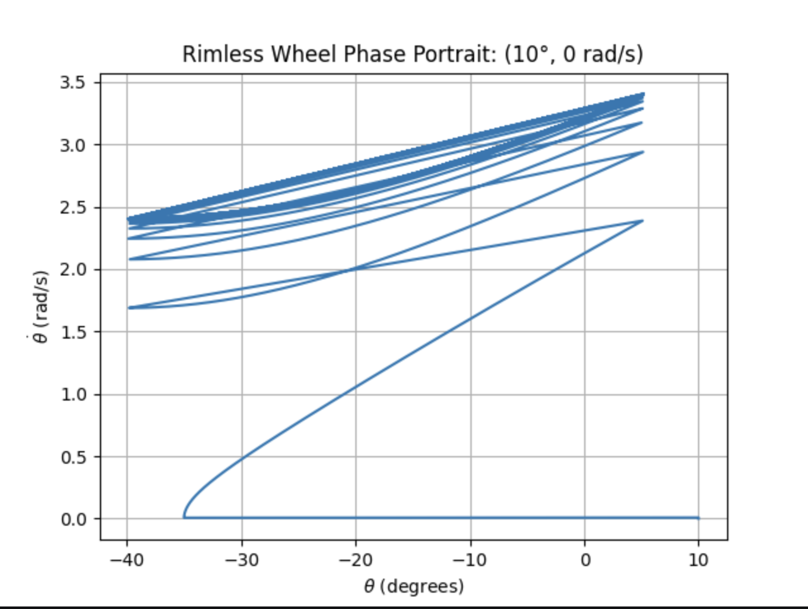

Abha Bhole
MAE 4110
-------------------------------------------------------------------------
Assignment 1 Deliverable - A markdown file reporting:

1. an explanation of your sanity checks, including what you expected and what happened; (5 pts)

2. a state-space plot showing the RoA of every stable attractor, including fixed points and limit cycles; (5 pts)

3. your one-dimensional return-map plot, with its fixed point and the identity line clearly marked; and (5 pts)

4. visualization and discussion of how the slope and number of spokes affects the RoA and local convergence (10 pts)

-------------------------------------------------------------------------
-------------------------------------------------------------------------

## 1. Sanity Checks

## 1. Sanity Checks

### Model Notes

For the current model, I use the following angle convention:

* $\theta$ is measured from the **global upward vertical**.
* Positive $\theta$ is counterclockwise, while negative $\theta$ is clockwise.
* The downhill direction of the slope is clockwise.
* The slope angle is denoted by $\gamma$.
* The angle between adjacent spokes is $2\alpha$, where

  $$
  \alpha = \frac{\pi}{N}.
  $$

With this convention, the continuous dynamics while a single spoke is in contact with the ground are

$$
\ddot{\theta}
=
-\frac{g}{l}\sin(\theta+\gamma).
$$

Therefore, the continuous-time state-space dynamics are

$$
\dot{\theta} = \dot{\theta},
\qquad
\ddot{\theta}
=
-\frac{g}{l}\sin(\theta+\gamma).
$$

The $\gamma$ term appears because $\theta$ is measured relative to the **global vertical**, rather than relative to the slope normal.

#### Impact and Reset

An impact occurs when the next spoke reaches the slope. The pre-impact stance-spoke angle is

$$
\theta^- = -\gamma-\alpha.
$$

At this instant, the adjacent spoke becomes the new stance spoke. The new stance spoke is at $+\alpha$ relative to the global vertical, so the angular coordinate is shifted by

$$
\gamma+2\alpha.
$$

So the angle reset is

$$
\theta^+
=
\theta^-+\gamma+2\alpha.
$$

The new spoke then begins its trajectory at

$$
\theta^+ = \alpha.
$$

The angular velocity is reset using conservation of angular momentum about the new contact point:

$$
\dot{\theta}^+
=
\dot{\theta}^-\cos(2\alpha).
$$

Therefore, the complete impact/reset map used in the simulation is

$$
\boxed{
\theta^+ = \theta^-+\gamma+2\alpha,
\qquad
\dot{\theta}^+ =
\dot{\theta}^-\cos(2\alpha)
}
$$

These continuous dynamics and discrete impact/reset dynamics together define the hybrid rimless-wheel model used in the simulation.

### 1.1 Angle vs. Time

I first plotted the stance-spoke angle $\theta$ versus time to get a general sense of the wheel's motion and verify that the simulation behaved as expected. For a stationary wheel, I would expect $\theta$ to remain approximately constant. In contrast, a rolling rimless wheel should produce a periodic sawtooth-like trajectory: during each stance phase, $\theta$ evolves continuously until the next spoke reaches the slope, at which point the stance spoke switches and the angle is reset.

The figure below shows (example)

### 1.2 Phase Portrait

I also plotted the trajectory in state space, using $\theta$ and $\dot{\theta}$ as the state variables. The initial condition for this test was $(\theta,\dot{\theta})=(10^\circ,0)$.

The phase portrait provides an additional qualitative check of the simulated dynamics by showing how angular position and angular velocity evolve together during the continuous stance phase and across discrete impacts. The repeated trajectory associated with successive impacts also provides a visual indication of the wheel approaching its periodic rolling gait.

-------------------------------------------------------------------------

## 2. Region of Attraction

I estimated the region of attraction (RoA) by simulating a grid of initial conditions and classifying each trajectory based on its long-term behavior. A trajectory was classified as converging to the walking limit cycle if the final five impact velocities differed by less than $0.05$ rad/s.

For a $200\times200$ grid with

$$
\theta\in[-\pi,\pi)
$$

and

$$
\dot{\theta}\in[-18,18]\text{ rad/s},
$$

the simulation produced:

* **Equilibrium:** 0 points
* **Limit cycle:** 20,732 points
* **Unclassified:** 19,268 points

The resulting plot shows a broad region of initial conditions that converge to the periodic walking gait. The unclassified region represents initial conditions for which the trajectory did not satisfy the limit-cycle classification criterion within the simulation time; therefore, these points are not necessarily unstable or divergent.

### Equilibrium

I also identified an equilibrium of the continuous dynamics at

$$
(\theta,\dot{\theta})=(-\gamma,0).
$$

For the $20^\circ$ slope used in this particular simulation, this corresponds to approximately

$$
(\theta,\dot{\theta})=(-20^\circ,0).
$$

This equilibrium is **unstable**, so it is not an attractor and is therefore not part of the region of attraction of the walking limit cycle. I included it in the classification mainly as a reference point and as a useful check on the continuous dynamics.

The equilibrium does not appear in the color map as one of the 200×200 grid points because the finite grid does not necessarily contain the exact value $\theta=-\gamma$. Therefore, the reported value of zero equilibrium points does **not** indicate that the equilibrium is absent from the system. A finer grid could sample the equilibrium more closely, but the 200×200 grid was used because of the computational cost of the simulations.

-------------------------------------------------------------------------

## 3. Return Map and Floquet Multiplier

For $N=8$ spokes and a slope angle of $20^\circ$, I constructed a one-dimensional return map using the pre-impact angular velocity as the Poincaré-section variable. The initial condition used to generate the trajectory was

$$
(\theta,\dot{\theta})=(25^\circ,0).
$$

The resulting return map converged to a fixed point at

$$
\dot{\theta}^-_* = 3.394\ \text{rad/s},
$$

where $\dot{\theta}^-$ denotes the angular velocity immediately before impact. The corresponding post-impact angular velocity was

$$
\dot{\theta}^+_* = 2.400\ \text{rad/s}.
$$

To estimate the Floquet multiplier, I perturbed the post-impact fixed point by $\pm0.01$ rad/s and measured the resulting post-impact velocity at the next crossing. The perturbations produced

$$
2.3896 \rightarrow 2.3944\ \text{rad/s}
$$

and

$$
2.4096 \rightarrow 2.4040\ \text{rad/s}.
$$

Using the local slope of the return map gave an estimated Floquet multiplier of

$$
\lambda \approx 0.480.
$$

Since $|\lambda|<1$, small perturbations from the fixed point decay from one step to the next, indicating that the rolling limit cycle is locally stable.

-------------------------------------------------------------------------
## 4. Return Map and RoA Sweeps

### Slope Sweep

The Floquet multiplier remained essentially constant as slope inclination was varied from $5^\circ$ to $35^\circ$. The numerical value was approximately $0.480$.

Each sweep used a $101\times101$ grid, for a total of 10,201 initial conditions.

| Slope angle | Equilibrium | Limit cycle | Unclassified |
|---:|---:|---:|---:|
| $5^\circ$  | 0 (0.00%) | 8,909 (89.09%) | 1,091 (10.91%) |
| $10^\circ$ | 0 (0.00%) | 8,960 (89.60%) | 1,040 (10.40%) |
| $15^\circ$ | 0 (0.00%) | 9,005 (90.05%) | 995 (9.95%) |
| $20^\circ$ | 0 (0.00%) | 9,055 (90.55%) | 945 (9.45%) |
| $25^\circ$ | 0 (0.00%) | 9,101 (91.01%) | 899 (8.99%) |
| $30^\circ$ | 0 (0.00%) | 9,147 (91.47%) | 853 (8.53%) |
| $35^\circ$ | 0 (0.00%) | 9,200 (92.00%) | 800 (8.00%) |

As the slope angle increased, the fraction of initial conditions classified as converging to the limit cycle increased from $89.09\%$ to $92.00\%$, while the unclassified fraction decreased from $10.91\%$ to $8.00\%$.

Increasing the slope slightly increased the region classified as belonging to the walking limit cycle over the sampled state space. However, the Floquet multiplier remained approximately $0.480$, indicating that the slope had little effect on the local convergence rate of the limit cycle.

============================================================
Slope SWEEP SUMMARY (newest, 100x100, velocity -18 to 18)
============================================================
Slope = 5
  Equilibrium:      0 (  0.00%)
  Limit cycle:   5030 ( 50.30%)
  Unclassified:  4970 ( 49.70%)

Slope = 10
  Equilibrium:      0 (  0.00%)
  Limit cycle:   5081 ( 50.81%)
  Unclassified:  4919 ( 49.19%)

Slope = 15
  Equilibrium:      0 (  0.00%)
  Limit cycle:   5123 ( 51.23%)
  Unclassified:  4877 ( 48.77%)

Slope = 20
  Equilibrium:      0 (  0.00%)
  Limit cycle:   5171 ( 51.71%)
  Unclassified:  4829 ( 48.29%)

Slope = 25
  Equilibrium:      0 (  0.00%)
  Limit cycle:   5221 ( 52.21%)
  Unclassified:  4779 ( 47.79%)

Slope = 30
  Equilibrium:      0 (  0.00%)
  Limit cycle:   5263 ( 52.63%)
  Unclassified:  4737 ( 47.37%)

Slope = 35
  Equilibrium:      0 (  0.00%)
  Limit cycle:   5316 ( 53.16%)
  Unclassified:  4684 ( 46.84%)

### Number of Spokes Sweep

The number of spokes was varied from 6 to 12 while keeping the slope angle fixed at $20^\circ$. The same $101\times101$ grid was used for each case.

| Number of spokes | Equilibrium | Limit cycle | Unclassified |
|---:|---:|---:|---:|
| 6  | 0 (0.00%) | 9,054 (90.54%) | 946 (9.46%) |
| 7  | 0 (0.00%) | 9,055 (90.55%) | 945 (9.45%) |
| 8  | 0 (0.00%) | 9,055 (90.55%) | 945 (9.45%) |
| 9  | 0 (0.00%) | 9,055 (90.55%) | 945 (9.45%) |
| 10 | 0 (0.00%) | 9,055 (90.55%) | 945 (9.45%) |
| 11 | 0 (0.00%) | 9,055 (90.55%) | 945 (9.45%) |
| 12 | 0 (0.00%) | 9,055 (90.55%) | 945 (9.45%) |

Over the sampled $101\times101$ state-space grid, changing the number of spokes from 6 to 12 produced almost no change in the fraction of states classified as converging to the limit cycle. The classification remained approximately $90.5\%$ limit-cycle states and $9.5\%$ unclassified states. This suggests that the global RoA, as measured by this particular grid and classification criterion, is relatively insensitive to the number of spokes.

However, the number of spokes does affect the local stability of the walking cycle. The Floquet multiplier increased as the number of spokes increased, making $\lambda$ larger and closer to 1. Therefore, although the measured global RoA changed very little in this sweep, increasing the number of spokes causes perturbations to decay more slowly from one step to the next.

============================================================
Number of spokes SWEEP SUMMARY (latest)
============================================================
Number of spokes = 6
  Equilibrium:      0 (  0.00%)
  Limit cycle:   5170 ( 51.70%)
  Unclassified:  4830 ( 48.30%)

Number of spokes = 7
  Equilibrium:      0 (  0.00%)
  Limit cycle:   5171 ( 51.71%)
  Unclassified:  4829 ( 48.29%)

Number of spokes = 8
  Equilibrium:      0 (  0.00%)
  Limit cycle:   5171 ( 51.71%)
  Unclassified:  4829 ( 48.29%)

Number of spokes = 9
  Equilibrium:      0 (  0.00%)
  Limit cycle:   5171 ( 51.71%)
  Unclassified:  4829 ( 48.29%)

Number of spokes = 10
  Equilibrium:      0 (  0.00%)
  Limit cycle:   5171 ( 51.71%)
  Unclassified:  4829 ( 48.29%)

Number of spokes = 11
  Equilibrium:      0 (  0.00%)
  Limit cycle:   5171 ( 51.71%)
  Unclassified:  4829 ( 48.29%)

Number of spokes = 12
  Equilibrium:      0 (  0.00%)
  Limit cycle:   5171 ( 51.71%)
  Unclassified:  4829 ( 48.29%)