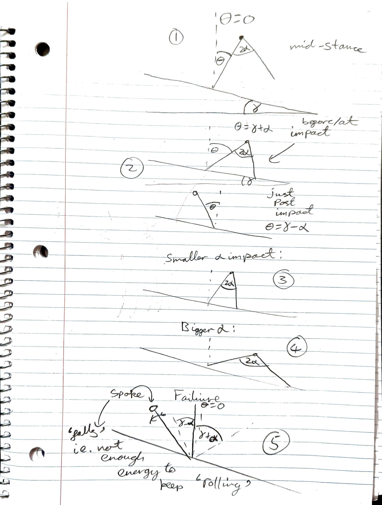
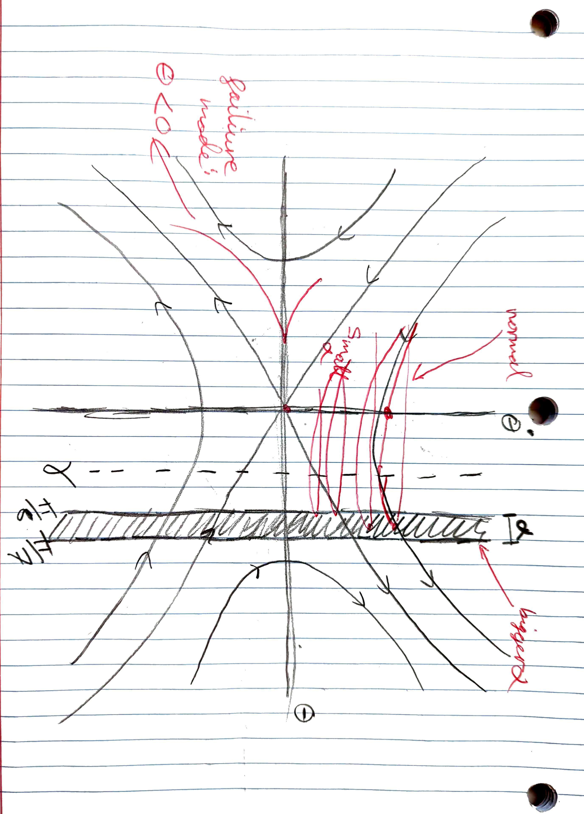
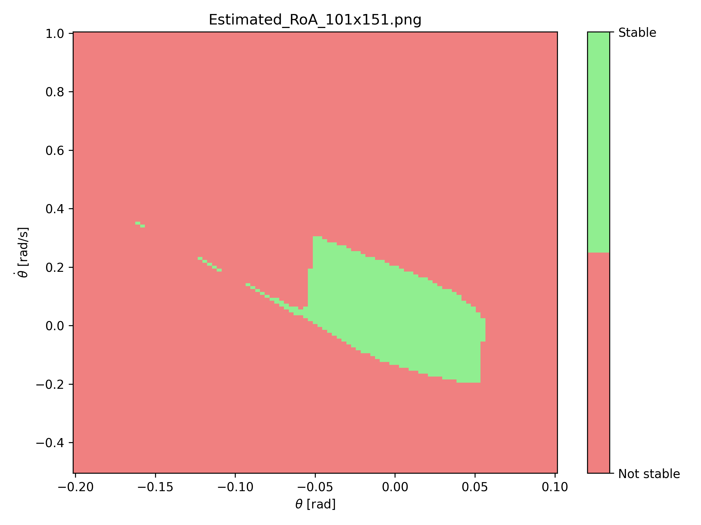
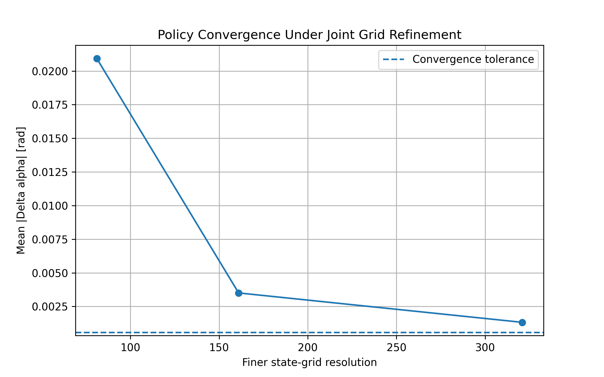
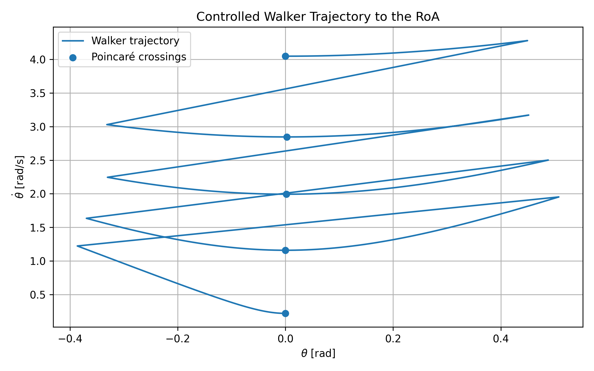
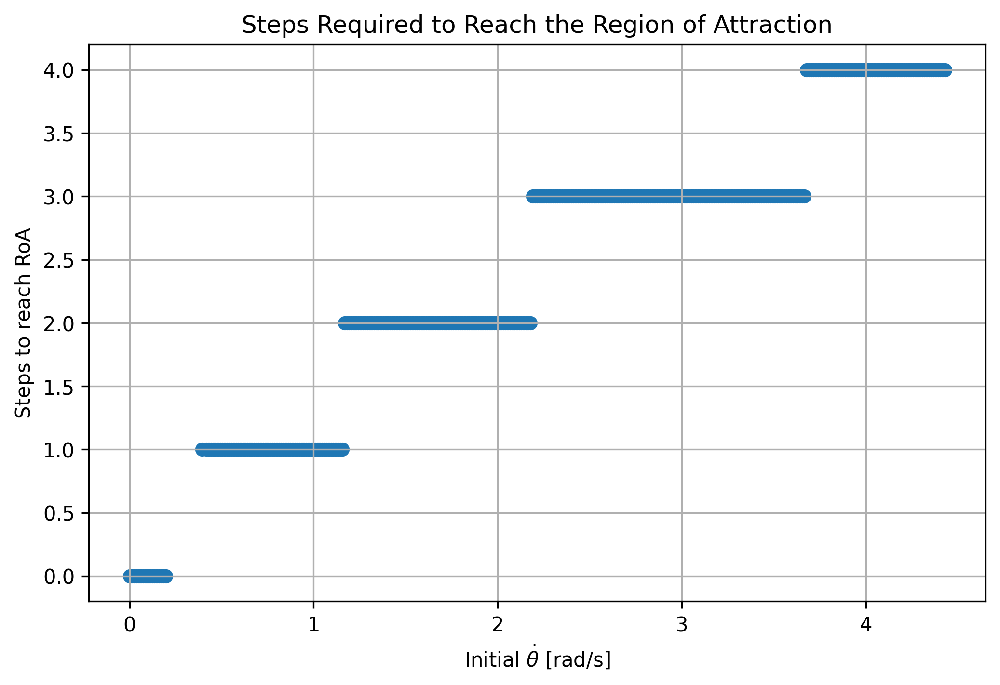

# 1. Sketches

The walker was modeled as an inverted pendulum with an actuated ankle and a controllable angle of attack. The following sketches show the walker configuration and the variables used in the model.

The main state variables are the pendulum angle $\theta$ and angular velocity $\dot{\theta}$. The control input is the angle of attack $\alpha$.

# 2. Region of Attraction

The first step was to determine the region of attraction (RoA) for the ankle controller. The RoA was computed in the $(\theta,\dot{\theta})$ state space and indicates the initial conditions from which the walker eventually reaches the standing equilibrium.

The stable region is the set of states that eventually reach the standing equilibrium under the ankle controller. This RoA was also used when constructing the Poincaré-based policy: once a state reached the standing RoA, no additional walking steps were required.

# 3. Choice of Poincaré Section

For the walking controller, I used a Poincaré section at

$$
\theta = 0.
$$

I considered crossings where the walker moves from

$$
\theta < 0
$$

to

$$
\theta \geq 0.
$$

At each crossing, the state can be represented by $\dot{\theta}$. This reduces the state used by the walking policy from the full two-dimensional state $(\theta,\dot{\theta})$ to a one-dimensional Poincaré state.

This was useful because the goal of the policy is to choose an angle of attack that moves the walker toward the standing RoA. Instead of building a policy over the full continuous trajectory, I only need to determine how each control input changes $\dot{\theta}$ from one Poincaré crossing to the next.

The resulting state-action relationship was

$$
\dot{\theta}_k,\alpha_k
\longrightarrow
\dot{\theta}_{k+1}.
$$

The angle of attack was restricted to

$$
\frac{\pi}{8} \leq \alpha \leq \frac{\pi}{7}.
$$

# 4. Poincaré Grid Resolution

The policy was computed on a grid of initial Poincaré states $\dot{\theta}$ and control inputs $\alpha$. I wanted to make sure that the selected grid was fine enough that increasing the resolution did not significantly change the resulting policy.

The state range and $\alpha$ range were kept fixed while the number of grid points was increased.

For each resolution, I computed the state-action map and selected the control input that moves each state toward the standing RoA. I then compared the resulting policy with the policy from the next finer grid.

The difference between two policies was measured using the mean absolute change in the selected angle of attack:

$$
\mathrm{error} = \frac{1}{N} \sum_i \left| \alpha_i^{\mathrm{fine}} - \alpha_i^{\mathrm{coarse}} \right|
$$

Choosing the convergence tolerance

I wanted the allowable policy error to be small relative to the total range of possible control inputs.

The $\alpha$ range is

$$
\Delta\alpha_{\mathrm{range}} = \frac{\pi}{7} - \frac{\pi}{8} = 0.05610\ \mathrm{rad}
$$

I used $1%$ of this range as the convergence tolerance:

$$
\epsilon = 0.01\Delta\alpha_{\mathrm{range}} = 5.61\times10^{-4}\ \mathrm{rad}
$$

The grid was considered converged when the mean policy change was below this tolerance for two consecutive refinements.

Initial refinement

I first used relatively large changes in resolution to see how the policy changed as the grid was refined:

$$
21\times5,\quad 41\times9,\quad 81\times17,\quad 161\times33,\quad 321\times65
$$

The mean policy differences for the final three comparable refinements were

$$
0.020937,\qquad 0.003506,\qquad 0.001321\ \mathrm{rad}
$$

The policy was clearly becoming less sensitive to the grid resolution, but the $321\times65$ grid was still above the convergence tolerance of $0.000561$ rad.

Refinement near convergence

Since the policy was changing more slowly at higher resolutions, I then refined the grid in smaller increments near the apparent convergence region.

The resolutions tested were

$$
321\times65 \rightarrow 341\times69 \rightarrow 361\times73
$$

The results were:

| Refinement                            | Mean change in $\alpha$ |
| ------------------------------------- | ----------------------: |
| $321\times65 \rightarrow 341\times69$ |          $0.000311$ rad |
| $341\times69 \rightarrow 361\times73$ |          $0.000442$ rad |

Both changes were below the $0.000561$-rad tolerance. Since this happened for two consecutive refinements, the convergence criterion was satisfied.

The final grid was therefore selected as

$$
\boxed{361\times73}
$$

with 361 Poincaré-state points and 73 possible $\alpha$ values.

At this resolution, the spacing between adjacent Poincaré states is

$$
\Delta\dot{\theta} = 0.012304\ \mathrm{rad/s}
$$

The $321\times65$ grid was not used as the final resolution because the refinement from it still changed the policy by $0.000311$ rad, while the $361\times73$ grid gave a second consecutive refinement below the specified tolerance. This provided a numerical check that the selected resolution was not simply chosen because it was the largest grid tested.

# 5. Walking Trajectory and Maximum Number of Steps

Using the final $361\times73$ grid, I computed how many walking steps were required for each initial Poincaré state to reach the standing RoA.

Out of the 361 Poincaré states in the final grid, 345 were reachable from the available state-action transitions.

The largest number of steps required to reach the RoA was

$$
\boxed{4\text{ steps}}.
$$

There were several initial conditions requiring four steps. I selected

$$
\dot{\theta}_0 = 4.048022\ \mathrm{rad/s}
$$

as a representative example.

The resulting policy was:

| Step | $\dot{\theta}$ | $\alpha$ | Next $\dot{\theta}$ |
| ---- | -------------: | -------: | ------------------: |
| 1    |       4.048022 | 0.392699 |            2.846056 |
| 2    |       2.842228 | 0.392699 |            1.989288 |
| 3    |       1.993251 | 0.430099 |            1.158812 |
| 4    |       1.156578 | 0.448020 |            0.182238 |

After the fourth step, the walker reaches the region of attraction of the standing controller.

The selected initial condition therefore satisfies the requirement of starting from a state that takes at least three steps, while also requiring the maximum number of steps found on the final grid.

The trajectory shows the walker being brought progressively closer to the standing RoA. The first two steps use the lower end of the available angle-of-attack range, while the later steps use larger values of $\alpha$ as the walker approaches the standing region.

The maximum number of walking steps found on the final grid was 4.

# 6. Number of Steps to Reach the RoA

Finally, I visualized how many steps are required to reach the standing RoA for each initial Poincaré state.

For each value of $\dot{\theta}$, the policy calculation determines the minimum number of Poincaré transitions needed to reach a state that is already inside the standing RoA.

The plot is shown as a scatter plot, with the horizontal axis representing the initial Poincaré state $\dot{\theta}$ and the vertical axis representing the number of steps required to reach the RoA.

A value of zero means that the initial state is already inside the standing RoA. Larger values indicate that additional walking steps are required before the standing controller can take over.

For the final $361\times73$ grid, the largest value was

$$
\boxed{4\text{ steps}}.
$$

The selected initial condition

$$
\dot{\theta}_0=4.048022\ \mathrm{rad/s}
$$

is one of the states requiring four steps.

# Summary

The final Poincaré policy used a $361\times73$ state-action grid. The grid-resolution study showed that two consecutive refinements produced mean policy changes below the $0.000561$-rad tolerance:

$$
0.000311\ \mathrm{rad},
\qquad
0.000442\ \mathrm{rad}.
$$

The final Poincaré-state spacing was

$$
\Delta\dot{\theta}=0.012304\ \mathrm{rad/s}.
$$

Using this policy, 345 of the 361 sampled Poincaré states were reachable, and the maximum number of walking steps required to reach the standing RoA was 4. A representative four-step trajectory was generated from

$$
\dot{\theta}_0=4.048022\ \mathrm{rad/s}.
$$

